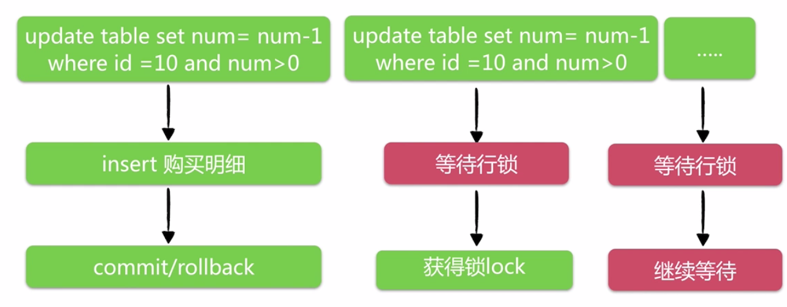
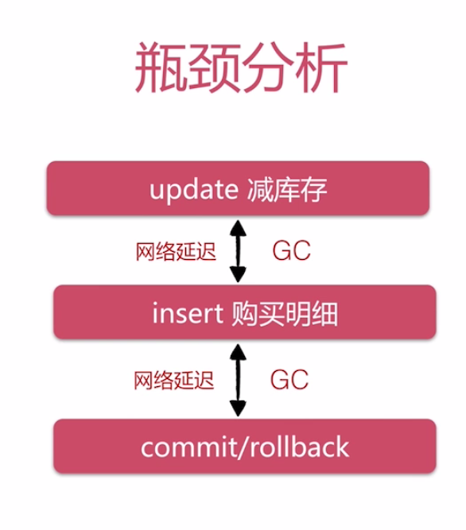

# Java高并发藐视API

- 使用SpringMVC + Spring + MyBatis 的原因

1. 框架易于使用
2. 低代码侵入性
3. 成熟的社区和用户群

---

- Restful接口设计和使用
- 框架运作流程
- Controller开发技巧

https://github.com/codingXiaxw/seckill

## 创建项目

- 使用Maven命令创建web骨架项目

`
mvn archetype:create -DgroupId=my.test.seckill -DartifactId=seckill -DarchetypeArtifactId=maven-archetype-webapp
`
> 注意：Maven后期版本的archetype插件取消了create命令，改为：generate
`
mvn archetype:generate -DgroupId=my.test.seckill -DartifactId=seckill -DarchetypeArtifactId=maven-archetype-webapp
`

- 替换`web.xml`，新建的项目使用的是Servlet2.3,此版本jsp默认的el表达式不工作
解决方案：从tomcat的webapps目录下找一个示例粘贴过来

## 业务分析

- 秒杀业务流程


秒杀业务的核心 -->> 库存处理

- 用户针对库存业务分析


- 用户购买行为


- 关于数据落地

MySQL VS NoSQL

事务机制依然是目前最可靠的落地方案

## 秒杀系统的难点

- 难点问题-- “竞争”


对于MySQL，难点在于 **事务 + 行级锁**
- 事务


问题存在于 update 减库存

- 行级锁


- 实现功能


- 只实现以下秒杀相关功能
    - 秒杀接口暴露
    - 执行秒杀
    - 相关查询

## 数据库设计

```sql
-- 数据库初始化脚本

-- 创建数据库

CREATE DATABASE seckill;

-- 使用数据库
use seckill;

-- 创建秒杀库存表
CREATE TABLE seckill(
`seckill_id` bigint NOT NULL AUTO_INCREMENT COMMENT '商品库存id',
`name` VARCHAR(120) NOT NULL  COMMENT '商品名称',
`number` INT NOT NULL  COMMENT '库存数量',
`start_time` TIMESTAMP NOT NULL COMMENT '秒杀开始时间',
`end_time` TIMESTAMP  NOT NULL COMMENT '秒杀结束时间',
`create_time` TIMESTAMP NOT NULL DEFAULT CURRENT_TIMESTAMP COMMENT '创建时间',
PRIMARY KEY (seckill_id),
KEY idx_start_time(start_time),
KEY idx_end_time(end_time),
KEY idx_create_time(create_time)
)ENGINE=InnoDB AUTO_INCREMENT=1000 DEFAULT CHARSET=utf8 COMMENT='秒杀库存表';

-- 初始化数据
INSERT  INTO seckill(name,number,start_time,end_time)
VALUES
('1000元秒杀iphone',100,'2017-10-14 00:00:00','2017-10-15 00:00:00'),
('500元秒杀ipad',200,'2017-10-14 00:00:00','2017-10-15 00:00:00'),
('300元秒杀小米4',300,'2017-10-14 00:00:00','2017-10-15 00:00:00'),
('200元秒杀红米note',400,'2017-10-14 00:00:00','2017-10-15 00:00:00');

-- 秒杀成功明细表
-- 用户登陆认证相关信息
CREATE TABLE success_killed(
`seckill_id` BIGINT NOT NULL COMMENT '秒杀商品ID',
`user_phone` BIGINT NOT NULL COMMENT '用户手机号',
`state` TINYINT NOT NULL DEFAULT -1 COMMENT '状态标识：-1：无效 0：成功 1：已付款',
`create_time` TIMESTAMP NOT NULL COMMENT '创建时间',
PRIMARY KEY (seckill_id,user_phone),/*联合主键*/
KEY idx_create_time(create_time)
)ENGINE=InnoDB DEFAULT CHARSET=utf8 COMMENT='秒杀成功明细表';

-- 为什么手写DDL
-- 记录每次上线的DDL修改
-- 上线V0.1
ALTER TABLE seckill
  DROP INDEX idx_create_time,
  ADD INDEX  idx_c_s(start_time,create_time);

-- 上线V1.2
```

## DAO层实体和接口编码

- MyBatis


- MyBatis特点


- SQL写在哪？
    1. **XML提供SQL**
    2. 注解提供SQL

- 如何实现DAO接口
    1. **Mapper自动实现DAO接口**
    2. API编程方式实现DAO接口


> MyBatis的核心点之一：可以自由控制SQL

## MyBatis与Spring整合

整合目标：
1. 更少的编码
    - 只写接口，不写实现
2. 更少的配置
    - 别名 -- 包扫描
    - 配置扫描
        >自动扫描配置文件
    - dao实现
        >自动实现DAO接口
        >自动注入spring容器
3. 足够的灵活
    - 自己定制SQL
    - 自由传参
    - 结果集自动赋值

## 测试

/*错误
org.mybatis.spring.MyBatisSystemException: nested exception is org.apache.ibatis.binding.BindingException: Parameter 'offset' not found. Available parameters are [0, 1, param1, param2]
接口： List<Seckill> queryAll(int offet, int limit);
原因：Java没有保存形参的记录：queryAll(int offet, int limit) --> queryAll(arg0, arg1);
** 多个参数时，需要告诉MyBatis参数的名字，这样通过 #{} 取参数时才可以识别
* 解决方法： 使用@Param 注解
* List<Seckill> queryAll(@Param("offset") int offet, @Param("limit") int limit);
*/

## service层

- 业务接口：站在“使用者”的角度设计接口
三个方面：方法定义粒度、参数、返回类型(return 类型/异常)


dto数据传输层  关注的是web和service的数据传递
entity 对业务的封装


- Spring IOC 功能理解


- 为什么用IOC
    - 对象创建统一管理
    - 规范的生命周期管理
    - 灵活的依赖注入
    - 一致的获取对象

- Spring IOC 注入方式和场景

|XML|注解|Java配置类|
|:--:|:--:|:--:|
|1、Bean实现类来自第三方类库，如：`DataSource`等<br/>2、需要命名空间配置，如：context、aop、mvc等|项目中自身开发使用的类，可直接在代码中使用注解，如:`@Service`、`@Controller`等|需要通过代码控制对象常见逻辑的场景，如：自定义修改依赖类库|

@Component 
@Service 
@Controller

@Autowired @Resource


## Spring的声明式事务

- 什么是声明式事务


- 声明式事务使用方式
    - `ProxyFactoryBean + XML` ----> 早期使用方式
    - `tx:advice + aop命名空间` ----> 一次配置，永久生效
    - `注解@Transactional`    ----> 注解控制  （*推荐使用*）

- 事务方法嵌套
声明式事务独有的概念

传播行为----> 默认：propagation_required

- 什么时候回滚事务

抛出运行期异常(RuntimeException)时回滚

小心不当的try-catch

- 配置Spring声明式事务
```
<!-- 配置基于注解的声明式事务
    默认使用注解来管理事务
-->
<tx:annotation-driven transaction-manager="transactionManager"/>
```

- 使用注解控制事务方法的有点
1. 开发团队达成一致约定，明确标注事务方法的编程风格
2. 保证事务方法的执行时间尽可能短，不要穿插其他网络操作，RPC/HTTP请求（或者剥离到事务方法外）
3. 不是所有的方法都需要事务，如：只有一条修改操作，只读操作不需要事务控制

## 秒杀系统WEB层

- 前端交互设计
- RESTful
- Spring MVC
- bootstrap+jquery

### 前端交互设计


### RESTful

> 一种优雅的URI表述方式

> 资源的状态和状态转移

- RESTful规范
    - GET --> 查询操作
    - POST --> 添加/修改操作
    - PUT --> 修改操作
    - DELETE --> 删除操作
- URL设计
    > /模块/资源/{标识}/集合1/...

### Spring MVC


- Spring MVC运行流程


- 注解映射技巧

`@RequestMapping`注解：
1. 支持标准的URL
2. Ant风格URL(即?和*和**等字符)
3. 带{xxx}占位符的RUL

- 请求方法细节处理
    1. 请求参数绑定
    2. 请求方法限制
    3. 请求转发和重定向
    4. 数据模型赋值
    5. 返回json数据
    6. cookie访问

示例：
```Java
//参数绑定
@RequestMapping(value="/{seckillId}/detail",method=RequestMethod.GET)
public String detail(@PathVariable("seckillId")Long seckillId,Model model){
    if(seckillId == null){
        return "redirect:/seckill/list";
    }
    Seckill seckill = seckillService.getById(seckillId);
    if(seckill == null){
        return "forward:/seckill/list";
    }
    model.addAttribute("seckill",seckill);
    return "detail";
}
```
返回JSON数据：
```Java
@RequestMapping(value="/{seckillId}/{md5}/execution",method=RequestMethod.GET,
produces = {"application/json;charset=UTF-8"})
@ResponseBody
public SeckillResult<Exposer> exportSeckillURL(@PathVariable("seckillId") long id){
    SeckillResult<Exposer> result;
   //....
    return result;
}
```

Cookie访问：`@CookieValue`
```Java
@RequestMapping(value="/{seckillId}/{md5}/execution",method=RequestMethod.GET)
public SeckillResult<Exposer> execute(@PathVariable("seckillId") long seckillId,
    @PathVariable("md5") String md5,
    @CookieValue(value="killPhone",required = false) Long phone)
{
    SeckillResult<Exposer> result;
   //....
    return result;
}
```

## 配置Spring MVC 框架


## 高并发优化

- 可能会发生高并发的点(红色)


- 使用CDN加速访问

静态资源部署到CDN节点


- CDN的理解
    - CDN(Content Delivery Network,内容分发网络)---加速用户获取数据的
    - 部署在离用户最近的网络节点上
    - 命中CDN不需要访问后端服务器

- 秒杀地址接口分析
    1. 无法使用CDN缓存
    2. 适合服务器断缓存：redis等
    3. 一致性维护成本低

- 秒杀地址接口优化


- 秒杀操作优化分析
    1. 无法使用CDN缓冲
    2. 后端缓存困难：库存问题
    3. 一行数据竞争：热点商品
- 优化方案：


该方案痛点（成本分析）：
1. 运维成本和稳定性：NoSQL、MQ等
2. 开发成本：数据库一致性，回滚方案
3. 幂等性难保证：重复秒杀问题
4. 不适合新手架构

- **为什么不用MySQL解决**
    - Java控制事务行为分析



- 瓶颈分析

  

- 优化分析

行级锁在commit之后释放 --->> 优化方向：减少行级锁持有时间

- 延迟分析
    - 网络问题很关键
    - update后JVM-GC(50ms左右) max(20qps)

如何判断Update更新库存成功？
两个条件：
1. update自身没有报错
2. 客户端确认update影响记录数

优化思路：
- 把客户端逻辑放到MySQL服务端，避免网络延迟和GC影响

如何放到MySQL服务端
两种解决方案：
1. 定制SQL方案：update /* + [auto_commit] */,需要修改MySQL源码。
2. 使用存储过程：整个事务在MySQL端完成。


## redis后端接口优化

- 引入Java访问Redis的客户端:Jedis

```xml
 <!--redis 客户端:Jedis-->
<dependency>
    <groupId>redis.clients</groupId>
    <artifactId>jedis</artifactId>
    <version>2.7.3</version>
</dependency>
```


